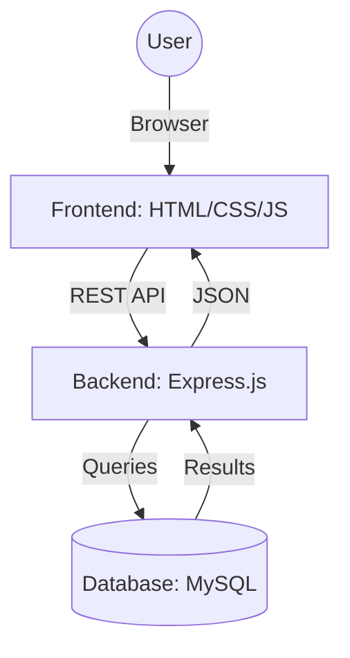

# 🫀 HopeLink — A Bridge of Hope Between Lives


**HopeLink** is a modern, centralised organ donation platform designed to bridge the gap between organ donors and recipients across India. By streamlining the registration process and implementing an intelligent matching algorithm, HopeLink aims to reduce logistical barriers and save lives through faster, more efficient connections.

---

## 🌟 Key Features

- **✦ Intelligent Matching**: Advanced algorithm based on ABO blood group compatibility and organ-specific clinical metrics (EF, MELD, TLC).
- **📍 Geographic Priority**: Intelligent search that prioritises donors within the same state before expanding to a national search.
- **🔒 Secure Registration**: Simple and secure workflows for both donors and recipients to register their details and medical requirements.
- **📊 Live Dashboard**: Real-time statistics showing active donors, recipients, and the impact of the platform.
- **📱 Responsive Design**: A "glassmorphism" aesthetic that works beautifully across desktops, tablets, and mobile devices.
- **🏥 Healthcare Integration**: Integration with national helplines and organisations like NOTTO and MOHAN Foundation.

---

## 🛠️ Technology Stack

| Layer | Technology |
|---|---|
| **Frontend** | HTML5, CSS3 (Modern Glassmorphism), Vanilla JavaScript |
| **Backend** | Node.js, Express.js |
| **Database** | MySQL 8.0+ |
| **Middleware** | CORS, Body-Parser, MySQL2 |

---

## 🏗️ System Architecture



---

## 🚀 Getting Started

### 1. Prerequisites
- [Node.js](https://nodejs.org/) (v14+)
- [MySQL](https://www.mysql.com/) (v8+)

### 2. Database Configuration
1. Log into your MySQL instance:
   ```bash
   mysql -u root -p
   ```
2. Import the schema and seed data:
   ```sql
   source database/schema.sql;
   ```

### 3. Backend Setup
1. Navigate to the backend directory:
   ```bash
   cd backend
   ```
2. Install dependencies:
   ```bash
   npm install
   ```
3. Start the server:
   ```bash
   npm start
   ```
   *The server will run at `http://localhost:3000`.*

### 4. Environment Variables
You can customize the following variables in your environment:
- `DB_HOST`: Database host (default: `localhost`)
- `DB_USER`: Database user (default: `root`)
- `DB_PASS`: Database password
- `DB_NAME`: Database name (default: `organ_donation`)
- `PORT`: Server port (default: `3000`)

---

## 🧠 Matching Logic

The HopeLink matching algorithm uses a multi-tier approach:

1.  **Blood Type**: Strict check using the universal compatibility table (e.g., O- donors are compatible with all recipients).
2.  **Clinical Metrics**:
    *   **Heart**: Ejection Fraction compatibility (± 10% tolerance).
    *   **Liver**: MELD score assessment and HLA typing matches.
    *   **Lungs**: Total Lung Capacity alignment (± 1L tolerance).
    *   **Pancreas**: Precise blood group and insulin level matching.
3.  **Logistics**: Prioritises state matches to minimise transport time and preserve organ viability.

---

## 📸 Preview


---

---

## 🚀 Deployment Instructions

### 1. Backend & Database (Railway)
1. **Database**: 
   - Create a new MySQL instance on Railway.
   - Use the `database/schema.sql` to initialize your tables and seed data.
2. **Server**:
   - Connect your GitHub repository to Railway.
   - Set the following environment variables in Railway:
     - `DB_HOST`, `DB_USER`, `DB_PASS`, `DB_NAME`, `DB_PORT` (Get these from your Railway MySQL variables).
     - `JWT_SECRET`: A long random string for token security.
     - `PORT`: `3000`.
   - Railway will automatically detect the `backend/Procfile` and start the server.

### 2. Frontend (Vercel)
1. **Configuration**:
   - Update `frontend/app.js` with your production Railway URL (the `API` constant).
2. **Deployment**:
   - Create a new project on Vercel and select your repository.
   - Set the **Root Directory** to `frontend`.
   - Vercel will use the `vercel.json` to handle routing correctly.

---

## 🧠 Matching Logic & AI
HopeLink now includes advanced AI-powered decision support:
- **Survival Prediction**: A Logistic Regression model predicts the probability of transplant success based on donor-recipient compatibility.
- **Compatibility Scoring**: Random Forest models calculate a % compatibility score using clinical data.
- **Urgency Scoring**: Heuristic-based prioritization (Critical, High, Moderate, Stable) based on MELD scores and Ejection Fraction.

---

## 📈 Future Roadmap
- [x] **Secure Auth**: JWT-based authentication for donors, recipients, and hospitals.
- [x] **Real-time Notifications**: Socket.io integration for instant match alerts.
- [x] **ML Scoring**: Machine Learning models for success prediction.
- [ ] **Modern Rebuild**: Transitioning to React.js or Next.js for better scalability.
- [ ] **Blockchain Integration**: Secure, immutable logs for organ allocation transparency.

## 🤝 Contribution

Contributions are welcome! Please feel free to submit a Pull Request or open an issue for any bugs or feature requests.

---

## 📄 License

This project is licensed under the MIT License - see the [LICENSE](LICENSE) file for details.

---

## 📞 Contact

**HopeLink Team**
- 📧 info@hopelink.org
- 🌐 [hopelink.org](http://localhost:3000)
- 📞 +1-800-555-0199

*Made with ♥ to save lives.*
