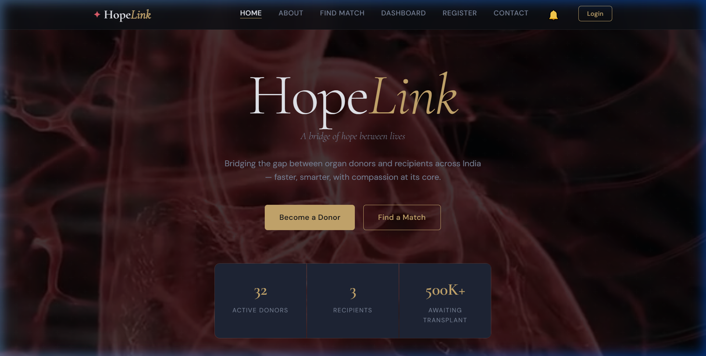

# HopeLink — Organ Donation System

### *Your Gift Lives On.*

---

### Description
"An AI-powered platform connecting organ donors with recipients across India — faster, smarter, and with compassion at its core."

---

### Screenshot

---

### Features
- AI-powered donor-recipient compatibility matching
- Blood group + organ-specific parameter filtering
- ML compatibility score and survival prediction
- State-priority search with national fallback
- Real-time notifications via Socket.io
- Secure JWT authentication for all user roles

---

### Tech Stack

---

### License
This project is licensed under the MIT License.

---

### Creator
**Built by Ananya Nair**  
VIT Bhopal University — Project Exhibition 2 — 2025

---

**Made with ❤️ to save lives**  
⭐ Star this repo if you find it meaningful
